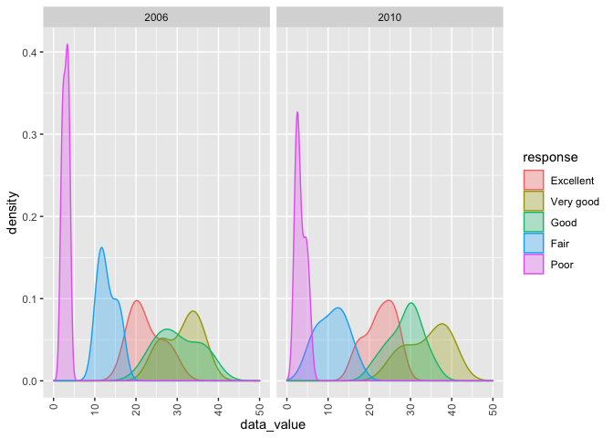

p8105\_hw3\_qc2307
================
Qixiang Chen
10/18/2021

``` r
library(tidyverse)
```

    ## ── Attaching packages ─────────────────────────────────────── tidyverse 1.3.1 ──

    ## ✓ ggplot2 3.3.5     ✓ purrr   0.3.4
    ## ✓ tibble  3.1.4     ✓ dplyr   1.0.7
    ## ✓ tidyr   1.1.3     ✓ stringr 1.4.0
    ## ✓ readr   2.0.1     ✓ forcats 0.5.1

    ## ── Conflicts ────────────────────────────────────────── tidyverse_conflicts() ──
    ## x dplyr::filter() masks stats::filter()
    ## x dplyr::lag()    masks stats::lag()

``` r
library(ggridges)
```

## Problem1

The goal is to do some exploration of this dataset. To that end, write a
short description of the dataset, noting the size and structure of the
data, describing some key variables, and giving illstrative examples of
observations. Then, do or answer the following (commenting on the
results of each):

``` r
library(p8105.datasets)
data("instacart")
instacart_df = janitor::clean_names(instacart) %>%
  drop_na() %>%
  distinct()
instacart_df
```

    ## # A tibble: 1,384,617 × 15
    ##    order_id product_id add_to_cart_order reordered user_id eval_set order_number
    ##       <int>      <int>             <int>     <int>   <int> <chr>           <int>
    ##  1        1      49302                 1         1  112108 train               4
    ##  2        1      11109                 2         1  112108 train               4
    ##  3        1      10246                 3         0  112108 train               4
    ##  4        1      49683                 4         0  112108 train               4
    ##  5        1      43633                 5         1  112108 train               4
    ##  6        1      13176                 6         0  112108 train               4
    ##  7        1      47209                 7         0  112108 train               4
    ##  8        1      22035                 8         1  112108 train               4
    ##  9       36      39612                 1         0   79431 train              23
    ## 10       36      19660                 2         1   79431 train              23
    ## # … with 1,384,607 more rows, and 8 more variables: order_dow <int>,
    ## #   order_hour_of_day <int>, days_since_prior_order <int>, product_name <chr>,
    ## #   aisle_id <int>, department_id <int>, aisle <chr>, department <chr>

``` r
instacart_row = nrow(instacart_df)
instacart_col = ncol(instacart_df)
aisleList = 
  group_by(instacart_df, aisle_id, aisle) %>%
  summarize(
    numOfObs = n()
    )
```

    ## `summarise()` has grouped output by 'aisle_id'. You can override using the `.groups` argument.

``` r
instacart_row
```

    ## [1] 1384617

``` r
instacart_col
```

    ## [1] 15

``` r
aisleList
```

    ## # A tibble: 134 × 3
    ## # Groups:   aisle_id [134]
    ##    aisle_id aisle                      numOfObs
    ##       <int> <chr>                         <int>
    ##  1        1 prepared soups salads          2936
    ##  2        2 specialty cheeses              3873
    ##  3        3 energy granola bars           17449
    ##  4        4 instant foods                  9917
    ##  5        5 marinades meat preparation     2905
    ##  6        6 other                          1795
    ##  7        7 packaged meat                  1526
    ##  8        8 bakery desserts                1501
    ##  9        9 pasta sauce                    9736
    ## 10       10 kitchen supplies                448
    ## # … with 124 more rows

1.  How many aisles are there, and which aisles are the most items
    ordered from?

``` r
aisleList %>%
  arrange(desc(numOfObs))
```

    ## # A tibble: 134 × 3
    ## # Groups:   aisle_id [134]
    ##    aisle_id aisle                         numOfObs
    ##       <int> <chr>                            <int>
    ##  1       83 fresh vegetables                150609
    ##  2       24 fresh fruits                    150473
    ##  3      123 packaged vegetables fruits       78493
    ##  4      120 yogurt                           55240
    ##  5       21 packaged cheese                  41699
    ##  6      115 water seltzer sparkling water    36617
    ##  7       84 milk                             32644
    ##  8      107 chips pretzels                   31269
    ##  9       91 soy lactosefree                  26240
    ## 10      112 bread                            23635
    ## # … with 124 more rows

``` r
aisleList
```

    ## # A tibble: 134 × 3
    ## # Groups:   aisle_id [134]
    ##    aisle_id aisle                      numOfObs
    ##       <int> <chr>                         <int>
    ##  1        1 prepared soups salads          2936
    ##  2        2 specialty cheeses              3873
    ##  3        3 energy granola bars           17449
    ##  4        4 instant foods                  9917
    ##  5        5 marinades meat preparation     2905
    ##  6        6 other                          1795
    ##  7        7 packaged meat                  1526
    ##  8        8 bakery desserts                1501
    ##  9        9 pasta sauce                    9736
    ## 10       10 kitchen supplies                448
    ## # … with 124 more rows

``` r
numOfAisle = row(aisleList)
```

Answer: There are `numOfAisle` aisles here. According to the data frame
`aisleList` arranged, the aisle “fresh vegetables” is the most items
ordered from.

2.  Make a plot that shows the number of items ordered in each aisle,
    limiting this to aisles with more than 10000 items ordered. Arrange
    aisles sensibly, and organize your plot so others can read it.

``` r
Items_10000_More = filter(aisleList, numOfObs > 10000)
aislePlot = ggplot(Items_10000_More, mapping = aes(x = aisle, y = numOfObs)) + 
  geom_col() + 
  labs(x = "Aisle", y = "Amount") +
  theme(axis.text.x = element_text(angle = 90, vjust = 0.5, hjust = 1))
aislePlot
```

<!-- -->

3.  Make a table showing the three most popular items in each of the
    aisles “baking ingredients”, “dog food care”, and “packaged
    vegetables fruits”. Include the number of times each item is ordered
    in your table.

``` r
instacart_selected = select(instacart_df, aisle, product_name)
most_popular_3bakingIng = filter(instacart_df, aisle == "baking ingredients") %>%
  count(aisle, product_name, name = "orderedAmount") %>%
  arrange(desc(orderedAmount)) %>%
  top_n(3)
```

    ## Selecting by orderedAmount

``` r
most_popular_3dogFood = filter(instacart_df, aisle == "dog food care") %>%
  count(aisle, product_name, name = "orderedAmount") %>%
  arrange(desc(orderedAmount)) %>%
  top_n(3)
```

    ## Selecting by orderedAmount

``` r
most_popular_3pkgVegeFruit = filter(instacart_df, aisle == "packaged vegetables fruits") %>%
  count(aisle, product_name, name = "orderedAmount") %>%
  arrange(desc(orderedAmount)) %>%
  top_n(3)
```

    ## Selecting by orderedAmount

``` r
most_popular_table = bind_rows(most_popular_3bakingIng, most_popular_3dogFood, most_popular_3pkgVegeFruit)
knitr::kable(most_popular_table)
```

| aisle                      | product\_name                                 | orderedAmount |
|:---------------------------|:----------------------------------------------|--------------:|
| baking ingredients         | Light Brown Sugar                             |           499 |
| baking ingredients         | Pure Baking Soda                              |           387 |
| baking ingredients         | Cane Sugar                                    |           336 |
| dog food care              | Snack Sticks Chicken & Rice Recipe Dog Treats |            30 |
| dog food care              | Organix Chicken & Brown Rice Recipe           |            28 |
| dog food care              | Small Dog Biscuits                            |            26 |
| packaged vegetables fruits | Organic Baby Spinach                          |          9784 |
| packaged vegetables fruits | Organic Raspberries                           |          5546 |
| packaged vegetables fruits | Organic Blueberries                           |          4966 |

4.  Make a table showing the mean hour of the day at which Pink Lady
    Apples and Coffee Ice Cream are ordered on each day of the week;
    format this table for human readers (i.e. produce a 2 x 7 table).

``` r
instacart_df
```

    ## # A tibble: 1,384,617 × 15
    ##    order_id product_id add_to_cart_order reordered user_id eval_set order_number
    ##       <int>      <int>             <int>     <int>   <int> <chr>           <int>
    ##  1        1      49302                 1         1  112108 train               4
    ##  2        1      11109                 2         1  112108 train               4
    ##  3        1      10246                 3         0  112108 train               4
    ##  4        1      49683                 4         0  112108 train               4
    ##  5        1      43633                 5         1  112108 train               4
    ##  6        1      13176                 6         0  112108 train               4
    ##  7        1      47209                 7         0  112108 train               4
    ##  8        1      22035                 8         1  112108 train               4
    ##  9       36      39612                 1         0   79431 train              23
    ## 10       36      19660                 2         1   79431 train              23
    ## # … with 1,384,607 more rows, and 8 more variables: order_dow <int>,
    ## #   order_hour_of_day <int>, days_since_prior_order <int>, product_name <chr>,
    ## #   aisle_id <int>, department_id <int>, aisle <chr>, department <chr>

``` r
PLApple_CICream_df = 
  filter(instacart_df, product_name %in% c("Pink Lady Apples", "Coffee Ice Cream")) %>%
  group_by(product_name, order_dow) %>%
  summarise(mean_hr = mean(order_hour_of_day)) %>%
  mutate(
    order_dow = recode(order_dow, 
                       "0" = "Sun",
                       "1" = "Mon",
                       "2" = "Tue",
                       "3" = "Wed",
                       "4" = "Thur",
                       "5" = "Fri",
                       "6" = "Sat")
    ) %>%
  pivot_wider(
    names_from = order_dow,
    values_from = mean_hr
  )
```

    ## `summarise()` has grouped output by 'product_name'. You can override using the `.groups` argument.

``` r
knitr::kable(PLApple_CICream_df)
```

| product\_name    |      Sun |      Mon |      Tue |      Wed |     Thur |      Fri |      Sat |
|:-----------------|---------:|---------:|---------:|---------:|---------:|---------:|---------:|
| Coffee Ice Cream | 13.77419 | 14.31579 | 15.38095 | 15.31818 | 15.21739 | 12.26316 | 13.83333 |
| Pink Lady Apples | 13.44118 | 11.36000 | 11.70213 | 14.25000 | 11.55172 | 12.78431 | 11.93750 |

short description of the dataset: In this dataset, the size is 1384617 x
15. The key variables include `order_id`, `product_id`, `product_name`,
`aisle`, `aisle_id`, and etc. The dataset includes all the observations
together. For example, in order 1, the first item that was added to
cartorder was Bulgarian Yogurt, which was considered yogurt aisle.

## Problem2

This problem uses the BRFSS data. DO NOT include this dataset in your
local data directory; instead, load the data from the p8105.datasets
package.

First, do some data cleaning:

1.format the data to use appropriate variable names; 2.focus on the
“Overall Health” topic 3.include only responses from “Excellent” to
“Poor” 4.organize responses as a factor taking levels ordered from
“Poor” to “Excellent”

Using this dataset, do or answer the following (commenting on the
results of each):

1.  In 2002, which states were observed at 7 or more locations? What
    about in 2010?
2.  Construct a dataset that is limited to Excellent responses, and
    contains, year, state, and a variable that averages the data\_value
    across locations within a state. Make a “spaghetti” plot of this
    average value over time within a state (that is, make a plot showing
    a line for each state across years – the geom\_line geometry and
    group aesthetic will help).
3.  Make a two-panel plot showing, for the years 2006, and 2010,
    distribution of data\_value for responses (“Poor” to “Excellent”)
    among locations in NY State.

Step1: loading the data.

``` r
library(p8105.datasets)
brfss_smart2010 = p8105.datasets::brfss_smart2010
```

Step2: format the data and deal with the vector of factor variable.

``` r
brfss_smart2010_formatted = 
  brfss_smart2010 %>%
  janitor::clean_names() %>%
  filter(topic == "Overall Health") %>%
  mutate(
    response = as.factor(response)
  ) %>%
  filter(response == "Excellent"|response == "Very good"|response =="Good"|response == "Fair"|response == "Poor" )
brfss_smart2010_formatted$response = factor(brfss_smart2010_formatted$response,
                                            levels = (c("Excellent", "Very good", "Good", "Fair", "Poor")))
brfss_smart2010_formatted
```

    ## # A tibble: 10,625 × 23
    ##     year locationabbr locationdesc  class  topic  question  response sample_size
    ##    <int> <chr>        <chr>         <chr>  <chr>  <chr>     <fct>          <int>
    ##  1  2010 AL           AL - Jeffers… Healt… Overa… How is y… Excelle…          94
    ##  2  2010 AL           AL - Jeffers… Healt… Overa… How is y… Very go…         148
    ##  3  2010 AL           AL - Jeffers… Healt… Overa… How is y… Good             208
    ##  4  2010 AL           AL - Jeffers… Healt… Overa… How is y… Fair             107
    ##  5  2010 AL           AL - Jeffers… Healt… Overa… How is y… Poor              45
    ##  6  2010 AL           AL - Mobile … Healt… Overa… How is y… Excelle…          91
    ##  7  2010 AL           AL - Mobile … Healt… Overa… How is y… Very go…         177
    ##  8  2010 AL           AL - Mobile … Healt… Overa… How is y… Good             224
    ##  9  2010 AL           AL - Mobile … Healt… Overa… How is y… Fair             120
    ## 10  2010 AL           AL - Mobile … Healt… Overa… How is y… Poor              66
    ## # … with 10,615 more rows, and 15 more variables: data_value <dbl>,
    ## #   confidence_limit_low <dbl>, confidence_limit_high <dbl>,
    ## #   display_order <int>, data_value_unit <chr>, data_value_type <chr>,
    ## #   data_value_footnote_symbol <chr>, data_value_footnote <chr>,
    ## #   data_source <chr>, class_id <chr>, topic_id <chr>, location_id <chr>,
    ## #   question_id <chr>, respid <chr>, geo_location <chr>

1.  In 2002, which states were observed at 7 or more locations? What
    about in 2010?

``` r
#In 2002
brfss_smart2010_location2002 = filter(brfss_smart2010_formatted, year == "2002") %>%
  group_by(locationabbr) %>%
  distinct(locationdesc)  %>%
  summarise(n = n()) %>%
  filter(n >= 7)
knitr::kable(brfss_smart2010_location2002)
```

| locationabbr |   n |
|:-------------|----:|
| CT           |   7 |
| FL           |   7 |
| MA           |   8 |
| NC           |   7 |
| NJ           |   8 |
| PA           |  10 |

``` r
#In 2010
brfss_smart2010_location2010 = filter(brfss_smart2010_formatted, year == "2010") %>%
  group_by(locationabbr) %>%
  distinct(locationdesc)  %>%
  summarise(n = n()) %>%
  filter(n >= 7)
knitr::kable(brfss_smart2010_location2010)
```

| locationabbr |   n |
|:-------------|----:|
| CA           |  12 |
| CO           |   7 |
| FL           |  41 |
| MA           |   9 |
| MD           |  12 |
| NC           |  12 |
| NE           |  10 |
| NJ           |  19 |
| NY           |   9 |
| OH           |   8 |
| PA           |   7 |
| SC           |   7 |
| TX           |  16 |
| WA           |  10 |

In year 2002, there were 6 states observed at 7 or more locations. The 6
states were CT, FL, MA, NC, NJ, PA. I year 2010, there were 10 states
observed at 7 or more locations. The 10 states were CA, CO, FL, MA, MD,
NC, NE, NJ, NY, OH.

2.  Construct a dataset that is limited to Excellent responses, and
    contains, year, state, and a variable that averages the data\_value
    across locations within a state. Make a “spaghetti” plot of this
    average value over time within a state (that is, make a plot showing
    a line for each state across years – the geom\_line geometry and
    group aesthetic will help).

``` r
brfss_Excellent = 
  brfss_smart2010_formatted %>%
  select(year, locationabbr, data_value, response) %>%
  filter(response == "Excellent") %>%
  group_by(year, locationabbr) %>%
  mutate(mean_value = mean(data_value, na.rm = TRUE))
spaghetti_plot = ggplot(brfss_Excellent, aes(x = year, y = mean_value, group = locationabbr, color = locationabbr)) +
  labs(x = "Year", y = "Average Value", tittle = "Spaghetti Plot", name = "State") +
  geom_line()
spaghetti_plot
```

<!-- --> The
Spaghetti Plot is shown above.

3.  Make a two-panel plot showing, for the years 2006, and 2010,
    distribution of data\_value for responses (“Poor” to “Excellent”)
    among locations in NY State.

``` r
brfss_Poor_2_Excellent = 
  brfss_smart2010_formatted %>%
  filter(locationabbr == "NY", (year == "2006" | year == "2010")) %>%
  drop_na(response) %>%
  group_by(locationdesc)
two_panel_06_10 = ggplot(brfss_Poor_2_Excellent, aes(x = response, y = data_value, group = locationdesc, color = locationdesc)) +
  geom_line() +
  facet_grid(. ~ year)
two_panel_06_10
```

<!-- --> The
two-panel plot has been shown above. It is about that the distribution
of data\_value for responses (“Poor” to “Excellent”) among locations in
NY State, for the years 2006 and 2010 respectively.

## Problem3

Accelerometers have become an appealing alternative to self-report
techniques for studying physical activity in observational studies and
clinical trials, largely because of their relative objectivity. During
observation periods, the devices measure “activity counts” in a short
period; one-minute intervals are common. Because accelerometers can be
worn comfortably and unobtrusively, they produce around-the-clock
observations.

This problem uses five weeks of accelerometer data collected on a 63
year-old male with BMI 25, who was admitted to the Advanced Cardiac Care
Center of Columbia University Medical Center and diagnosed with
congestive heart failure (CHF). The data can be downloaded here. In this
spreadsheet, variables activity.\* are the activity counts for each
minute of a 24-hour day starting at midnight.

1.  Load, tidy, and otherwise wrangle the data. Your final dataset
    should include all originally observed variables and values; have
    useful variable names; include a weekday vs weekend variable; and
    encode data with reasonable variable classes. Describe the resulting
    dataset (e.g. what variables exist, how many observations, etc).

``` r
accelerometer_df = read_csv("./data/accel_data.csv") %>%
  janitor::clean_names() %>%
  mutate(
    weekend = case_when(
      day == "Monday" ~ 0,
      day == "Tuesday" ~ 0,
      day == "Wednesday" ~ 0,
      day == "Thursday" ~ 0,
      day == "Friday" ~ 0,
      day == "Saturday" ~ 1, 
      day == "Sunday" ~ 1
    )
  ) %>%
  relocate(week, day_id, day, weekend)
```

    ## Rows: 35 Columns: 1443

    ## ── Column specification ────────────────────────────────────────────────────────
    ## Delimiter: ","
    ## chr    (1): day
    ## dbl (1442): week, day_id, activity.1, activity.2, activity.3, activity.4, ac...

    ## 
    ## ℹ Use `spec()` to retrieve the full column specification for this data.
    ## ℹ Specify the column types or set `show_col_types = FALSE` to quiet this message.

``` r
accelerometer_df
```

    ## # A tibble: 35 × 1,444
    ##     week day_id day       weekend activity_1 activity_2 activity_3 activity_4
    ##    <dbl>  <dbl> <chr>       <dbl>      <dbl>      <dbl>      <dbl>      <dbl>
    ##  1     1      1 Friday          0       88.4       82.2       64.4       70.0
    ##  2     1      2 Monday          0        1          1          1          1  
    ##  3     1      3 Saturday        1        1          1          1          1  
    ##  4     1      4 Sunday          1        1          1          1          1  
    ##  5     1      5 Thursday        0       47.4       48.8       46.9       35.8
    ##  6     1      6 Tuesday         0       64.8       59.5       73.7       45.7
    ##  7     1      7 Wednesday       0       71.1      103.        68.5       45.4
    ##  8     2      8 Friday          0      675        542       1010        779  
    ##  9     2      9 Monday          0      291        335        393        335  
    ## 10     2     10 Saturday        1       64         11          1          1  
    ## # … with 25 more rows, and 1,436 more variables: activity_5 <dbl>,
    ## #   activity_6 <dbl>, activity_7 <dbl>, activity_8 <dbl>, activity_9 <dbl>,
    ## #   activity_10 <dbl>, activity_11 <dbl>, activity_12 <dbl>, activity_13 <dbl>,
    ## #   activity_14 <dbl>, activity_15 <dbl>, activity_16 <dbl>, activity_17 <dbl>,
    ## #   activity_18 <dbl>, activity_19 <dbl>, activity_20 <dbl>, activity_21 <dbl>,
    ## #   activity_22 <dbl>, activity_23 <dbl>, activity_24 <dbl>, activity_25 <dbl>,
    ## #   activity_26 <dbl>, activity_27 <dbl>, activity_28 <dbl>, …

``` r
accelerometer_df_manipulated = 
  pivot_longer(accelerometer_df,
               activity_1:activity_1440,
               names_to = "activity",
               values_to = "activity_num",
               ) %>%
  separate(activity, into = c("activity","activity_min"), sep = "_") %>%
  select(-activity)
accelerometer_df_manipulated
```

    ## # A tibble: 50,400 × 6
    ##     week day_id day    weekend activity_min activity_num
    ##    <dbl>  <dbl> <chr>    <dbl> <chr>               <dbl>
    ##  1     1      1 Friday       0 1                    88.4
    ##  2     1      1 Friday       0 2                    82.2
    ##  3     1      1 Friday       0 3                    64.4
    ##  4     1      1 Friday       0 4                    70.0
    ##  5     1      1 Friday       0 5                    75.0
    ##  6     1      1 Friday       0 6                    66.3
    ##  7     1      1 Friday       0 7                    53.8
    ##  8     1      1 Friday       0 8                    47.8
    ##  9     1      1 Friday       0 9                    55.5
    ## 10     1      1 Friday       0 10                   43.0
    ## # … with 50,390 more rows

``` r
variable_amount = ncol(accelerometer_df_manipulated)
observation_amount = nrow(accelerometer_df_manipulated)
variable_amount
```

    ## [1] 6

``` r
observation_amount
```

    ## [1] 50400

After the manipulation to the dataset, there are 6 variables and 50400
observations. The key variables of the manipulated dataset include
`week`, `day_id`, `day, weekend`, `activity_min`, `activity_num`.

2.  Traditional analyses of accelerometer data focus on the total
    activity over the day. Using your tidied dataset, aggregate accross
    minutes to create a total activity variable for each day, and create
    a table showing these totals. Are any trends apparent?

``` r
accelerometer_total = 
  accelerometer_df_manipulated %>%
  group_by(day_id) %>%
  summarise(total_activity = sum(activity_num)) %>%
  arrange(day_id)
knitr::kable(accelerometer_total)
```

| day\_id | total\_activity |
|--------:|----------------:|
|       1 |       480542.62 |
|       2 |        78828.07 |
|       3 |       376254.00 |
|       4 |       631105.00 |
|       5 |       355923.64 |
|       6 |       307094.24 |
|       7 |       340115.01 |
|       8 |       568839.00 |
|       9 |       295431.00 |
|      10 |       607175.00 |
|      11 |       422018.00 |
|      12 |       474048.00 |
|      13 |       423245.00 |
|      14 |       440962.00 |
|      15 |       467420.00 |
|      16 |       685910.00 |
|      17 |       382928.00 |
|      18 |       467052.00 |
|      19 |       371230.00 |
|      20 |       381507.00 |
|      21 |       468869.00 |
|      22 |       154049.00 |
|      23 |       409450.00 |
|      24 |         1440.00 |
|      25 |       260617.00 |
|      26 |       340291.00 |
|      27 |       319568.00 |
|      28 |       434460.00 |
|      29 |       620860.00 |
|      30 |       389080.00 |
|      31 |         1440.00 |
|      32 |       138421.00 |
|      33 |       549658.00 |
|      34 |       367824.00 |
|      35 |       445366.00 |

Answer: There isn ’t a very apparent trend. Maybe, in Tuesday,
Wednesday, and Thursday, the total activity minutes in each of the five
weeks does not fluctuate too much.

3.  Accelerometer data allows the inspection activity over the course of
    the day. Make a single-panel plot that shows the 24-hour activity
    time courses for each day and use color to indicate day of the week.
    Describe in words any patterns or conclusions you can make based on
    this graph.

``` r
accelerometer_plot = 
  accelerometer_df_manipulated %>%
  ggplot(aes(x = as.numeric(activity_min), y = as.numeric(activity_num), color = day)) +
  labs(x = "Time (in minute)", y = "Activity", caption = "Accelerometer Activity Plot") +
  scale_x_continuous(
    breaks = c(0, 180, 360, 540, 720, 900, 1080, 1260, 1440),
    labels = c("0:00", "3:00", "6:00", "9:00", "12:00", "15:00", "18:00", "21:00", "23:59"),
    limits = c(0, 1440)) +
  geom_smooth() +
  theme(axis.text.x = element_text(angle = 90, vjust = 0.5, hjust = 1))
accelerometer_plot
```

    ## `geom_smooth()` using method = 'gam' and formula 'y ~ s(x, bs = "cs")'

<!-- -->
According to this graph, from 3:00 to 10:30 in morning, the activity
amount keeps increasing for each day. Then, from 10:30 to 18:00, the
activity amount stays unchanged. After that, from 18:00 to 21:00, the
activity amount increases again and then, it drops down. For Sunday and
Friday, the activity amount will be extremely high during the period
from 9:30 to 13:00 and the period from 17:30 to 23:00 respectively.
